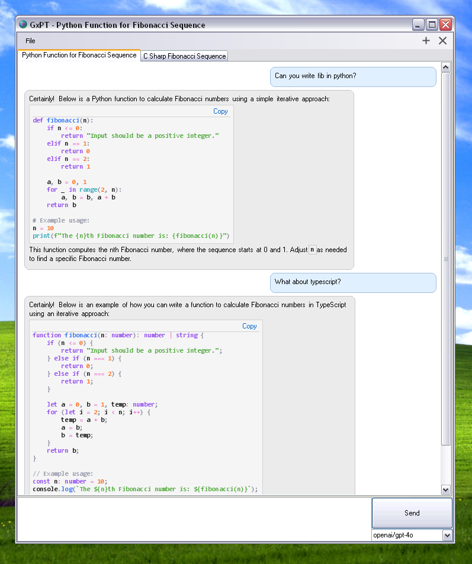

# GxPT

A native chatbot client for Windows XP, written in C# and. NET 3.5. GxPT aims to provide a modern and user-friendly chat interface on legacy Windows systems, with robust Markdown and code syntax highlighting support.

## Screenshot

## Features

- **Modern Chat UI**: Clean, responsive chat transcript display.
- **Markdown Rendering**: Supports headings, bold/italic, links, bullet and numbered lists (including deeply nested lists), tables, code blocks, and inline code.
- **Code Syntax Highlighting**: Out-of-the-box support for a wide range of languages, including:
  - C, C++, C#, Go, Java, JavaScript, JSON, Python, Ruby, Rust, TypeScript, Zig
- **Conversation Management**: Tabbed conversations and conversation history.
- **Data Stored Locally**: Conversations are stored locally, but maybe exported and imported to migrate data across machines.
- **Settings and Customization**: Customize settings with Visual settings UI or built-in JSON editor. 
- **Frontier Model Support**: Support for a huge range of AI models, including frontier models, from the OpenRouter.ai API. 
- **Legacy Compatibility**: Runs on Windows XP and .NET 3.5.

## Getting Started

1. **Requirements**
   - Windows XP or later (XP optimized)
   - .NET Framework 3.5

2. **Building**
   - Open the solution in Visual Studio 2008 or later.
   - Build the solution; required libraries are included.
   - Build the setup project
   - Run `GxPT.exe`,  or install via `GxPT.Setup.msi`. 

3. **Configuration**
   - Launch the app and open the settings window to configure your API key and preferences.
   - For OpenRouter.ai, see the in-app help page for instructions on obtaining and entering an API key.