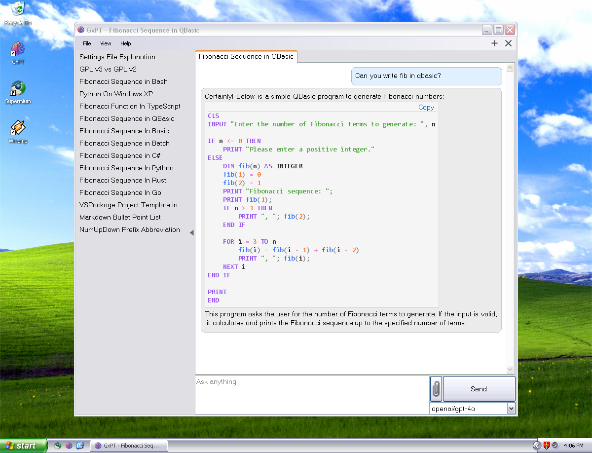
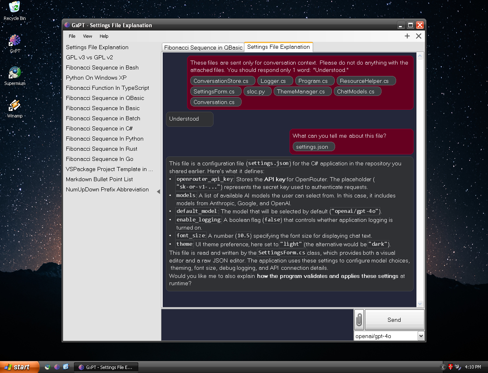
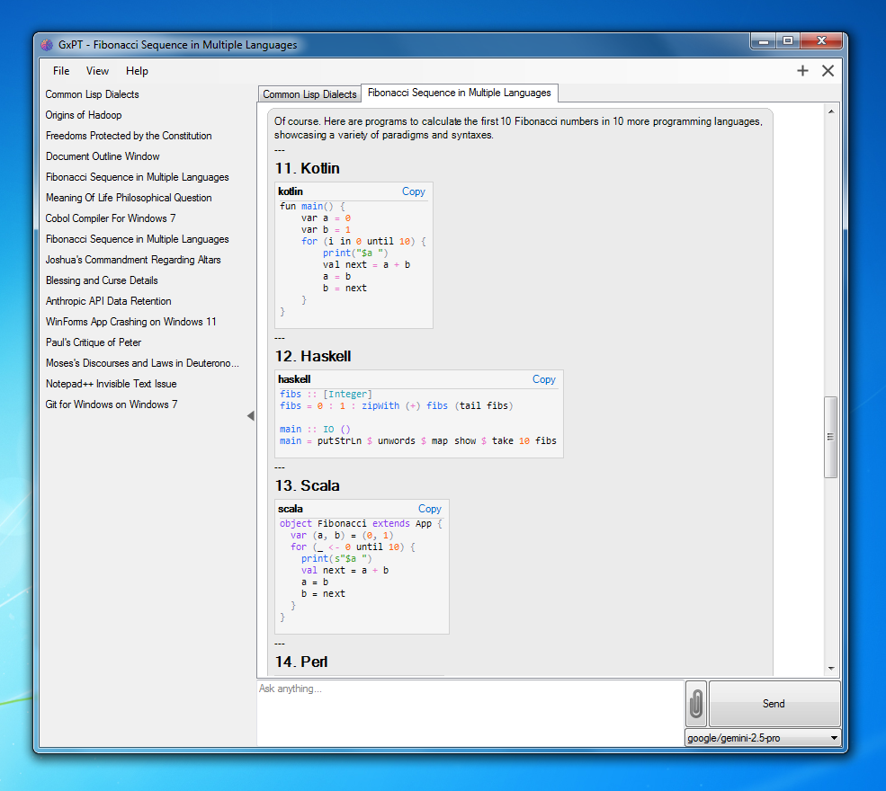

# GxPT

> *Windows XP goes agentic!*

A native chatbot client and coding agent for Windows XP. GxPT aims to provide a modern and user-friendly chat interface on legacy Windows systems, with robust Markdown and code syntax highlighting support. It also brings agentic workflows to the era of Luna and Aero - autonomously chaining tools for agentic coding and web search via the Model Context Protocol (MCP), with per-conversation privacy controls.

## Screenshot

### Light Mode:

### Dark Mode:

### Windows 7:

## Features

- **Modern Chat UI**: Clean, responsive chat transcript display.
- **Markdown Rendering**: Supports headings, bold/italic, links, bullet and numbered lists (including deeply nested lists), tables, code blocks, and inline code.
- **Code Syntax Highlighting**: Out-of-the-box support for a wide range of languages, including:
   - Ada, ASM, Bash, Basic, Batch, C, Clojure, C++, C#, CSS, CSV, Dart, EBNF, Elixir, Erlang, F#, Fortran, Go, Haskell, HTML, Java, JavaScript, JSON, Kotlin, Lisp (Common, Scheme/Racket, Clojure, Emacs), Lua, OCaml, Pascal, Perl, PHP, PowerShell, Properties, Python, Ruby, Regex, Rust, Scala, SQL, Swift, TypeScript, Visual Basic, XML, YAML, Zig
- **Conversation Management**: Tabbed conversations and conversation history.
- **Agentic Workflows**: GxPT autonomously chains tool calls until your task is done, powering **agentic coding** (file/git/shell), **web search**, and **GitHub** access. Tools connect via the [Model Context Protocol](https://modelcontextprotocol.io/); add custom servers in `mcp.json`.
- **Tool Approval & Sandboxing**: Every tool call is gated by an in-app approval prompt showing the exact tool and arguments before it runs, with approvals remembered per session. File/git/command tools are confined to the working folder you choose.
- **File Attachments**: Add text file attachments to your messages to avoid cluttering up the conversation with long pasted text.
- **Conversation Editing**: Don't like the response a model gave you? Go back and edit your message and get a new response.
- **Privacy & Local Storage**: Conversations are stored locally and can be exported/imported to migrate across machines. Enforce **Zero Data Retention (ZDR)** per conversation to route only to providers that won't store your prompts or responses.
- **Settings and Customization**: Customize settings with Visual settings UI or built-in JSON editor. 
- **Frontier Model Support**: Support for a huge range of AI models, including frontier models, from the OpenRouter.ai API. 
- **Legacy Compatibility**: Runs on Windows XP and .NET 3.5.

## Getting Started

1. **Requirements**
   - Windows XP or later (XP optimized)
   - .NET Framework 3.5

2. **Building & Running**
   - Open the solution in Visual Studio 2008 or later.
   - Build the solution; required libraries are included. This also builds the bundled MCP servers (file/git/command/web), which are deployed alongside `GxPT.exe`.
   - Build the setup project.
   - Run `GxPT.exe`, or install via `GxPT.Setup.msi`. 

3. **Configuration**
   - Launch the app and open the settings window to configure your API key and preferences.
   - See the in-app help page for instructions on obtaining and entering an OpenRouter API key.
   - To enable tools, open the **MCP** tab in settings: toggle the built-in servers, paste a Tavily key (web search) or GitHub PAT, and edit `mcp.json` for custom servers. File, git, and command tools activate once you set a working folder for a conversation.